</div>

<div align="center">

[English](README.md) | 简体中文

</div>

# [m3axpi] YOLOv8训练到部署全流程
### 介绍
YOLOv8 是<a href="https://ultralytics.com"> Ultralytics </a>公司于 2023 年 1 月 10 日开源的 2d 实时目标检测算法。涵盖 yolov8n、yolov8s、yolov8m、yolov8l、yolov8x、yolov8x6 等多个模型。YOLOv8 旨在快速、准确且易于使用，使其成为广泛的对象检测、图像分割和图像分类任务的绝佳选择。


本教程讲解 YOLOv8 的模型训练并用 Sipeed 公司的开发板 m3axpi 进行部署，了解产品请看 https://wiki.sipeed.com/m3axpi 以下为实拍效果。

https://user-images.githubusercontent.com/32978053/216542487-0d17a9e4-ca81-4e67-a087-4ecf18b34feb.mp4

### 开始


首先创建工作目录,以下所有操作均在此目录内。

右键打开终端,执行以下命令:
```bash
cd ~
mkdir m3axpi && cd m3axpi
```


### 一、准备数据集

如何制作目标检测数据集请参考(链接),本教程用标注好的“垃圾检测“数据集对整个流程进行讲解。该数据集可以通过以下三种方式获取:

1.直接下载

Github: https://github.com/Abandon-ht/coco_rubbish_dataset/archive/refs/heads/main.zip

将下载的数据集解压到 datasets 文件夹,并重命名为 rubbish

2.拉取数据集的仓库

```bash
mkdir datasets && cd datasets
git clone https://github.com/Abandon-ht/coco_rubbish_dataset.git rubbish
```

3.终端命令下载

```bash
mkdir datasets && cd datasets
wget https://github.com/Abandon-ht/coco_rubbish_dataset/archive/refs/heads/main.zip
unzip coco_rubbish_dataset-main.zip
mv coco_rubbish_dataset-main rubbish
```

三种方法都可以得到以下 2 个文件夹和 3 个文件


### 二、获取 yolov8 源码

在 m3axpi 目录下(注意不是在 datasets 目录下),拉取 yolov8 源码的仓库

```bash
cd ~/m3axpi
git clone https://github.com/ultralytics/ultralytics.git  # clone
cd ultralytics
pip install -r requirements.txt  # install
pip install -e '.[dev]'  # develop
```

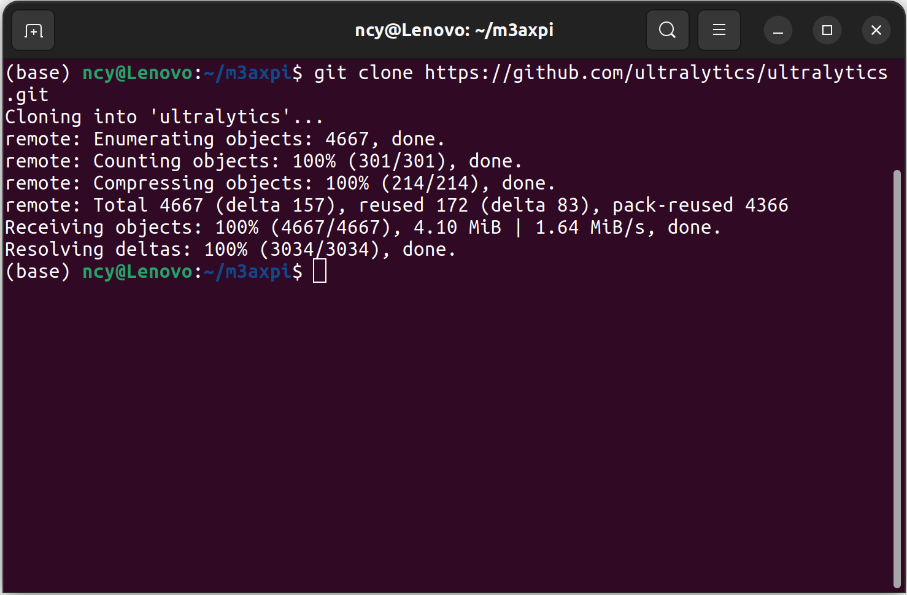

yolov8 目录如图所示:

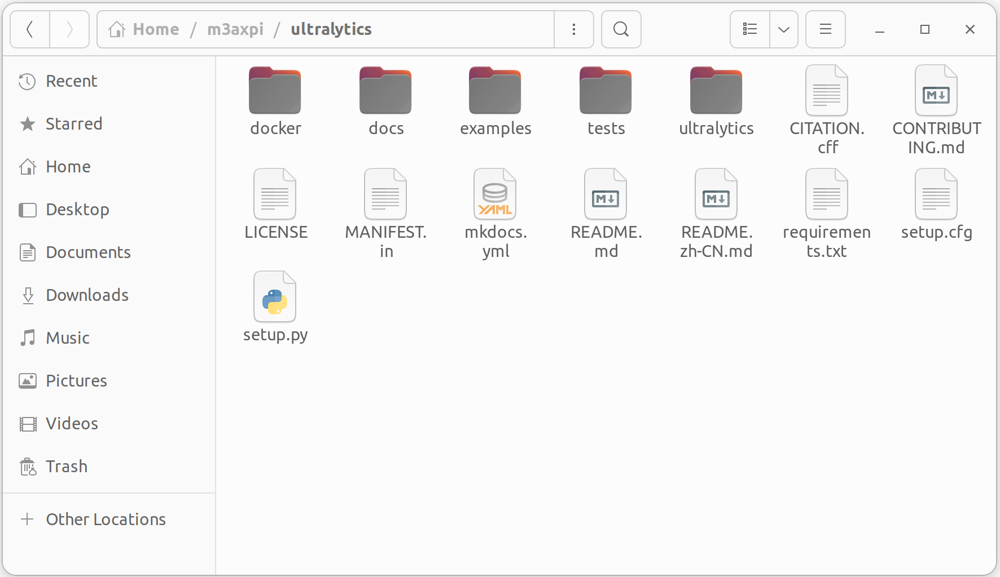


### 三、训练 yolov8 模型

进入 ultralytics 的工作目录, 复制一份 coco.yaml,并重命名为 rubbish.yaml

```bash
cp ultralytics/yolo/data/datasets/coco.yaml ultralytics/yolo/data/datasets/rubbish.yaml
```

根据图片修改垃圾分类数据集的路径和类别名字

```bash
# Train/val/test sets as 1) dir: path/to/imgs, 2) file: path/to/imgs.txt, or 3) list: [path/to/imgs1, path/to/imgs2, ..]
path: ../datasets/rubbish  # dataset root dir
train: train2017.txt  # train images (relative to 'path') 118287 images
val: val2017.txt  # val images (relative to 'path') 5000 images
# test: test-dev2017.txt  # 20288 of 40670 images, submit to https://competitions.codalab.org/competitions/20794

# Classes
names:
  0: battery
  1: pills
  2: bananas
  3: apples
  4: cans
  5: bottles
  6: ceram
  7: green vegatable
  8: broccoli
  9: boxes
  10: glass
  11: cigarette
  12: orange
  13: eggshell
  14: spitball
  15: tile
```


修改完成以后,用以下命令开始训练 yolov8s 模型

```bash
yolo task=detect mode=train model=yolov8s.pt data=rubbish.yaml batch=-1 epochs=20
```

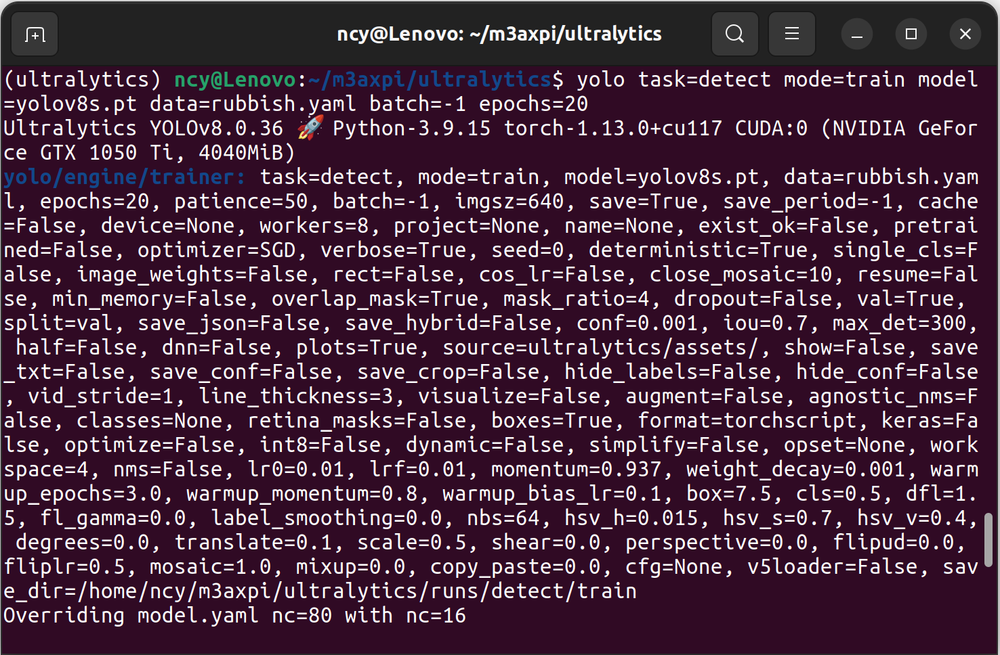

数据集加载成功,开始训练模型。如果没有加载成功,请检查数据集路径

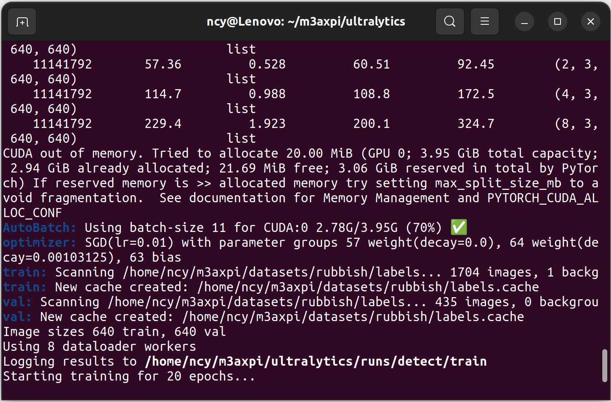

训练完成后,可以在 ./runs/detect/train/ 文件夹下查看训练的日志

PR_curve.png 为 mAP_0.5 曲线

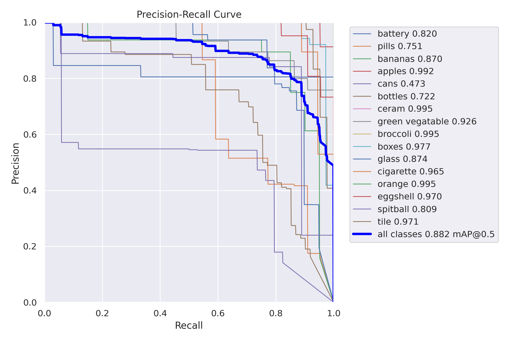

results.png 为全部曲线

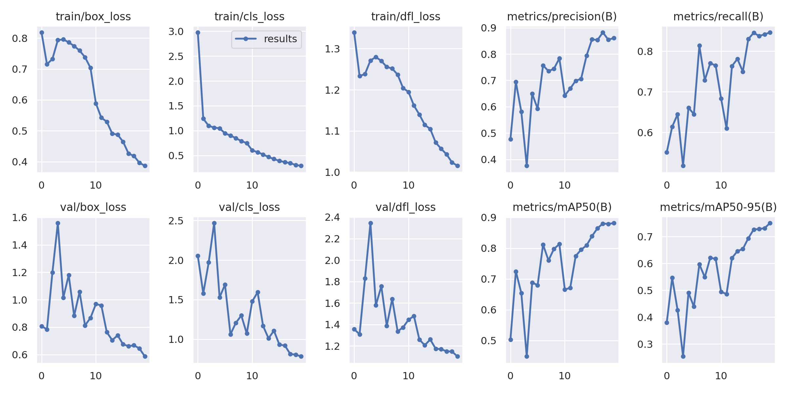

### 四、模型预测和导出

可以使用以下命令预测图片,注意需要将图片和模型的路径修改为自己的路径

```bash
yolo task=detect mode=predict model=./runs/detect/train/weights/best.pt source=../datasets/rubbish/images/IMG_20210311_213716.jpg save
```


可以在 runs/detect/predict 目录下。看到预测的图片

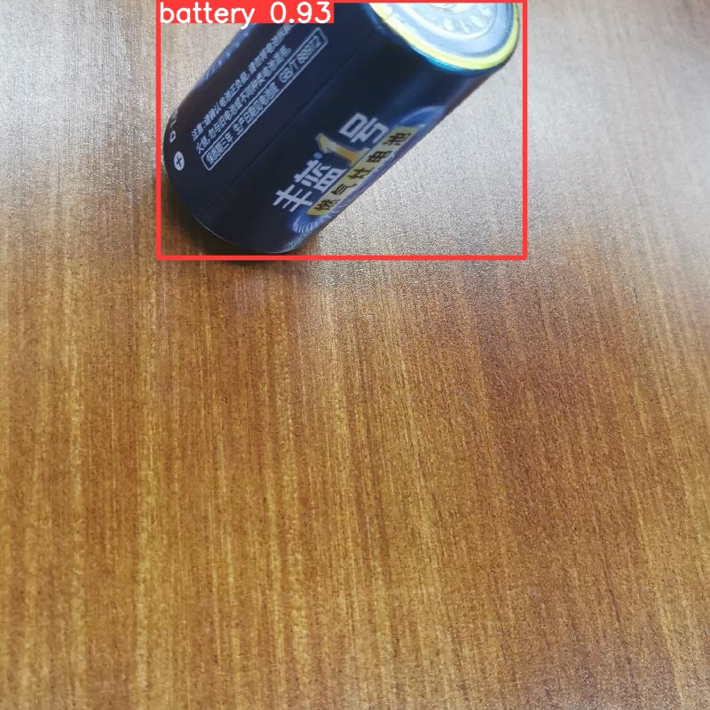

修改 ultralytics/nn/modules.py
class Detect(nn.Module):

```python
    def forward(self, x):
        shape = x[0].shape  # BCHW
        dfl = []
        cls = []
        cls_idx = []
        for i in range(self.nl):
            if self.export:
                dfl.append(self.cv2[i](x[i]))
                xi = self.cv3[i](x[i])
                cls.append(xi)
                cls_idx.append(torch.argmax(xi, dim=1, keepdim=True))
            else:
                x[i] = torch.cat((self.cv2[i](x[i]), self.cv3[i](x[i])), 1)
        if self.training:
            return x
        elif self.dynamic or self.shape != shape:
            self.anchors, self.strides = (x.transpose(0, 1) for x in make_anchors(x, self.stride, 0.5))
            self.shape = shape
        if self.export:
            return dfl, cls, cls_idx
        else:
            box, cls = torch.cat([xi.view(shape[0], self.no, -1) for xi in x], 2).split((self.reg_max * 4, self.nc), 1)
            dbox = dist2bbox(self.dfl(box), self.anchors.unsqueeze(0), xywh=True, dim=1) * self.strides
            y = torch.cat((dbox, cls.sigmoid()), 1)
            return y if self.export else (y, x)
```

修改 ultralytics/yolo/engine/exporter.py
class Exporter:

```python
        # self.output_shape = tuple(y.shape) if isinstance(y, torch.Tensor) else tuple(tuple(x.shape) for x in y)
        # LOGGER.info(f"\n{colorstr('PyTorch:')} starting from {file} with input shape {tuple(im.shape)} BCHW and "
        #             f"output shape(s) {self.output_shape} ({file_size(file):.1f} MB)")
```

使用以下命令导出 onnx 模型,注意加上 opset=11 这个参数

```bash
yolo task=detect mode=export model=./runs/detect/train/weights/best.pt format=onnx opset=11
```

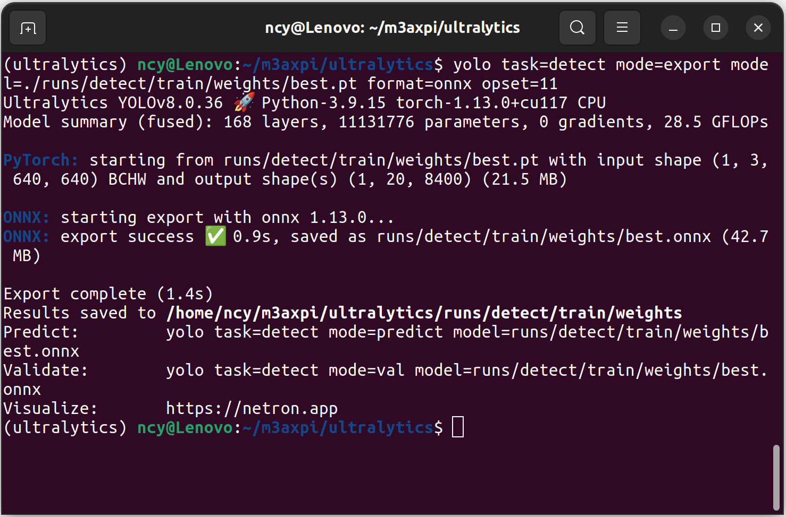

导出的 onnx 模型在 runs/detect/train/weights 目录下

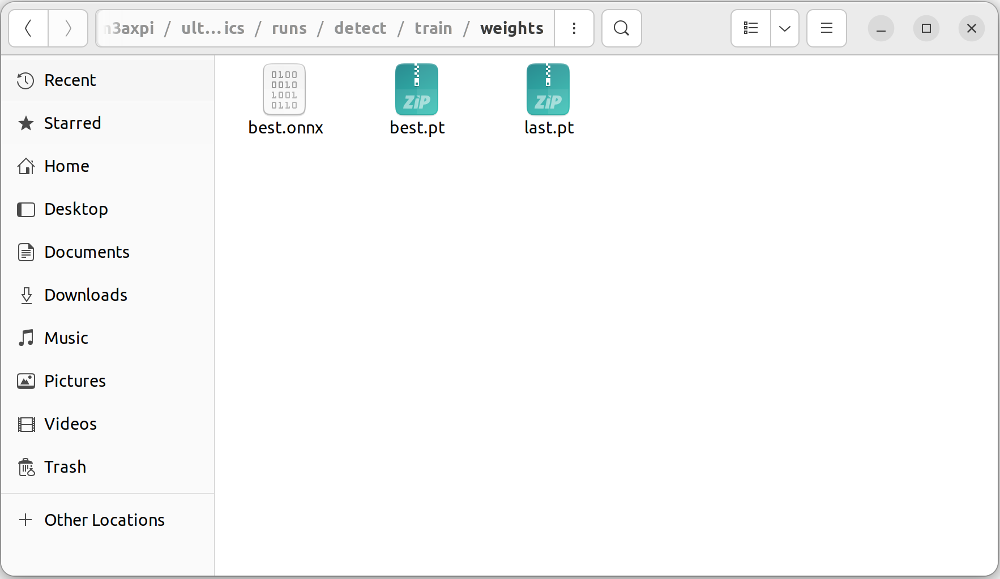

在浏览器地址栏中输入 netron.app (这个地址),把上一步导出的 best.onnx 文件拖进去,查看 yolov8 的模型结构。

模型的输入名字为:images

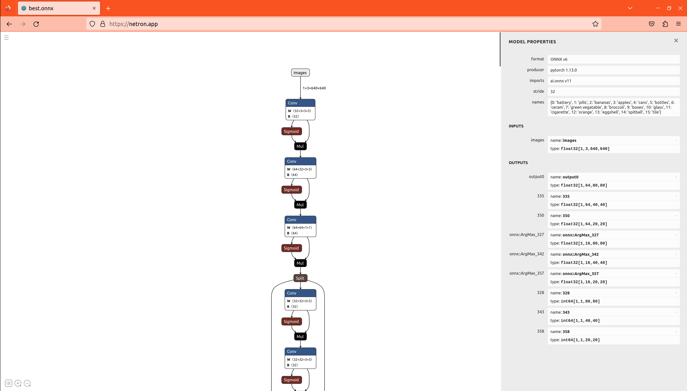

导出的模型如图所示,三个 Conv 的输出分别为 dfl、cls、cls_index

第一个 Conv 输出矩阵为 1 * 64 * 80 * 80, 1 * 16 * 80 * 80, 1 * 1 * 80 * 80


第一个 Conv 输出矩阵为 1 * 64 * 40 * 40, 1 * 16 * 40 * 40, 1 * 1 * 40 * 40

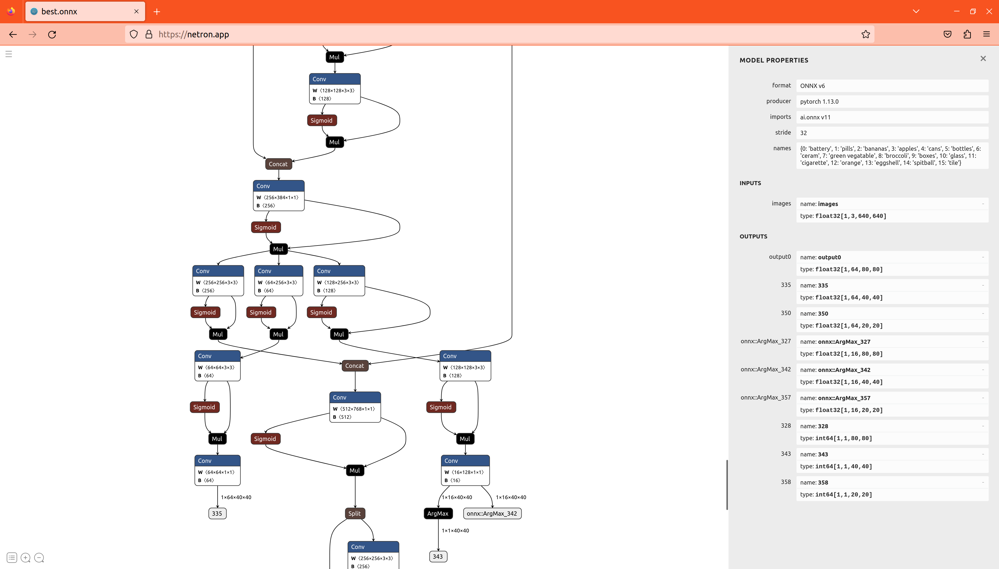

第三个 Conv 输出矩阵为 1 * 64 * 20 * 20, 1 * 16 * 20 * 20, 1 * 1 * 20 * 20

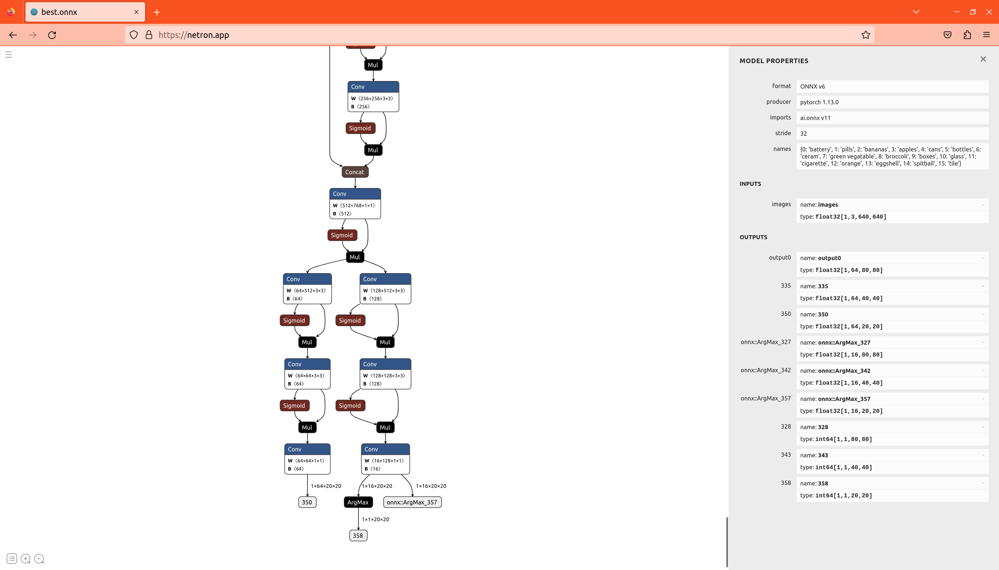

### 五、打包训练图片

进入数据集的图片目录,使用以下命令打包图片为rubbish_1000.tar,注意文件的扩展名是 .tar

```bash
cd  ~/m3axpi/datasets/rubbish/images/
tar -cvf rubbish_1000.tar *.jpg
```


创建 dataset 目录,使用以下命令把压缩包 rubbish_1000.tar 移动到 ~/dataset 目录

```bash
mkdir -p ~/m3axpi/dataset
mv ~/m3axpi/datasets/rubbish/images/rubbish_1000.tar ~/m3axpi/dataset
```


### 六、搭建模型转换环境

onnx 模型需要转换为 joint 模型才能在 m3axpi 运行,所以需要使用 pulsar 模型转换工具。注意 pb、tflite、weights、paddle 等模型,需要先转换为 onnx 模型才能使用 pulsar 模型转换工具

使用以下命令拉取带有模型转换工具的容器,没有安装docker请自行安装

```bash
docker pull sipeed/pulsar:0.6.1.20
```

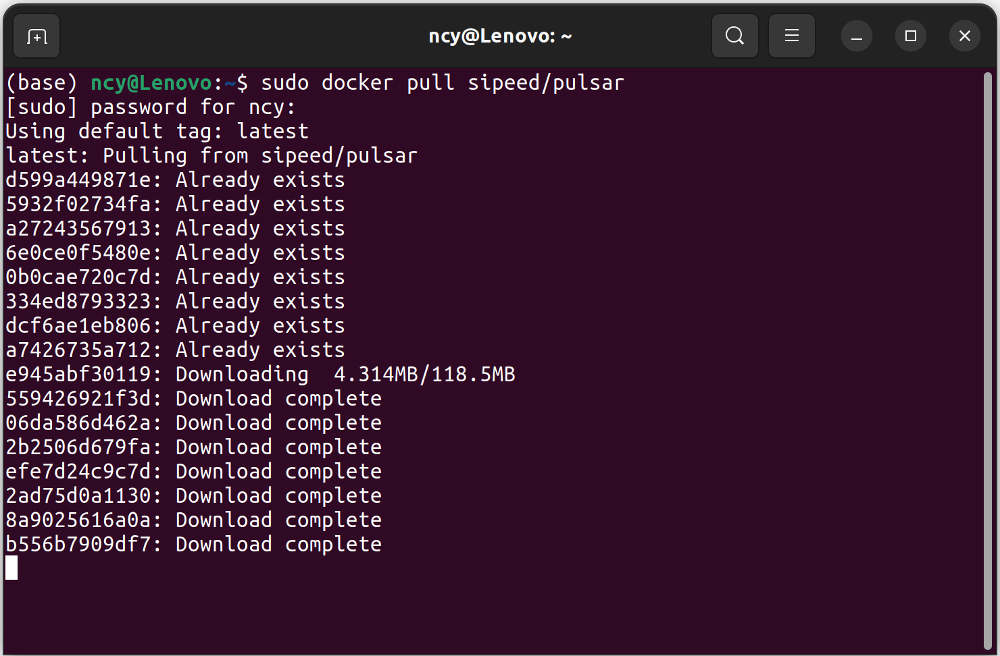

使用以下命令进入容器,如果需要保留该容器,请删除 --rm 这个参数。注意一定要设置共享内存,将 m3axpi 工作目录挂载到容器的 data 目录

```bash
cd ~/m3axpi
docker run -it --net host --rm --shm-size 16g -v $PWD:/data sipeed/pulsar
```


如果有 Nvidia GPU 环境,可以使用以下命令,使用带有GPU的容器,可以加快模型转换的速度

```bash
cd ~/m3axpi
docker run -it --net host --rm --gpus all --shm-size 16g -v $PWD:/data sipeed/pulsar
```


在工作目录下创建 config 和 onnx 文件夹。

```bash
cd ~/m3axpi
mkdir config onnx
```


在 config 下创建一份命名为 yolov8s_rubbish.prototxt 的文件,复制以下内容到文件,注意修改文件中 rubbish_1000.tar 的路径

```
# my_config.prototxt

# 基本配置参数:输入输出
input_type: INPUT_TYPE_ONNX

output_type: OUTPUT_TYPE_JOINT

# 选择硬件平台
target_hardware: TARGET_HARDWARE_AX620

# CPU 后端选择,默认采用 AXE
cpu_backend_settings {
    onnx_setting {
        mode: DISABLED
    }
    axe_setting {
        mode: ENABLED
        axe_param {
            optimize_slim_model: true
        }
    }
}

# input
src_input_tensors {
    color_space: TENSOR_COLOR_SPACE_RGB
}

dst_input_tensors {
    color_space: TENSOR_COLOR_SPACE_RGB
}

# neuwizard 工具的配置参数
neuwizard_conf {
    operator_conf {
        input_conf_items {
            attributes {
                input_modifications {
                    affine_preprocess {
                        slope: 1
                        slope_divisor: 255
                        bias: 0
                    }
                }
                # input_modifications {
                #     input_normalization {
                #         mean: [0,0,0]
                #         std: [0.5,0.5,0.5]
                #     }
                # }
            }
        }
    }
    dataset_conf_calibration {
        path: "/data/dataset/rubbish_1000.tar" # 数据集图片的 tar 包,用于编译过程中对模型校准
        type: DATASET_TYPE_TAR         # 数据集类型:tar 包
        size: 256                      # 编译过程中校准所需要的实际数据个数为 256
    }
    dataset_conf_error_measurement {
        path: "/data/dataset/rubbish_1000.tar" # 用于编译过程中对分
        type: DATASET_TYPE_TAR
        size: 4                        # 对分过程所需实际数据个数为 4
        batch_size: 1
    }

}

dst_output_tensors {
    tensor_layout:NHWC
}

# pulsar compiler 的配置参数
pulsar_conf {
    ax620_virtual_npu: AX620_VIRTUAL_NPU_MODE_111
    batch_size: 1
    debug : false
}
```


移动导出的模型文件 best.onnx 到 onnx 目录,使用以下命令进行模型转换:(注意修改模型文件的名字改为自己的模型名字)

```bash
pulsar build --input onnx/best.onnx --output yolov8s_rubbish.joint --config config/yolov8s_rubbish.prototxt --output_config yolov8s_rubbish.prototxt
```
开始转换

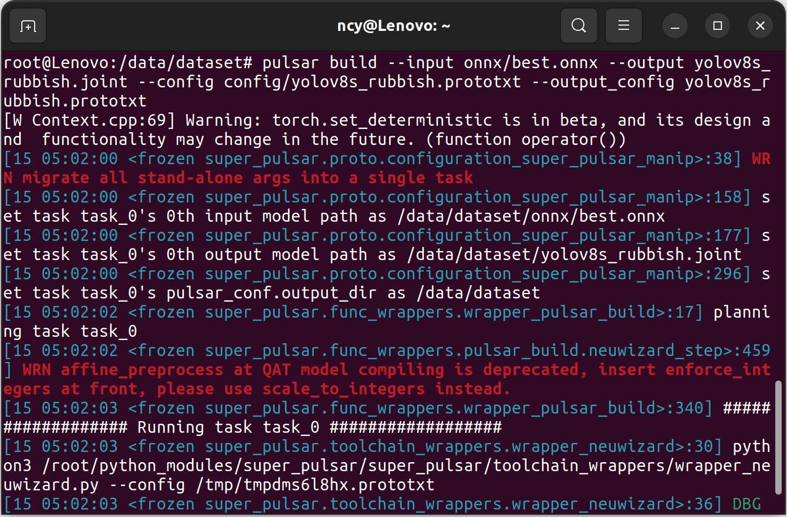

转换时间较长,请耐心等待

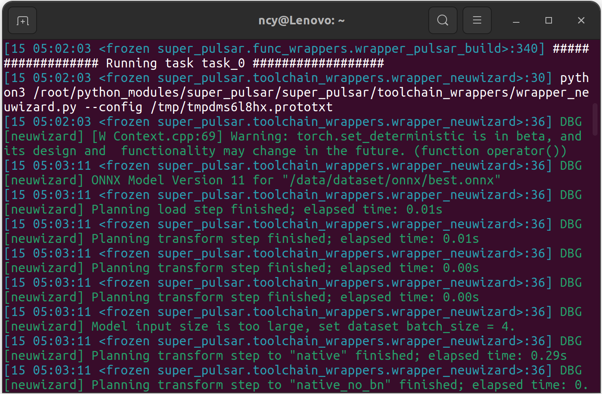

转换完成

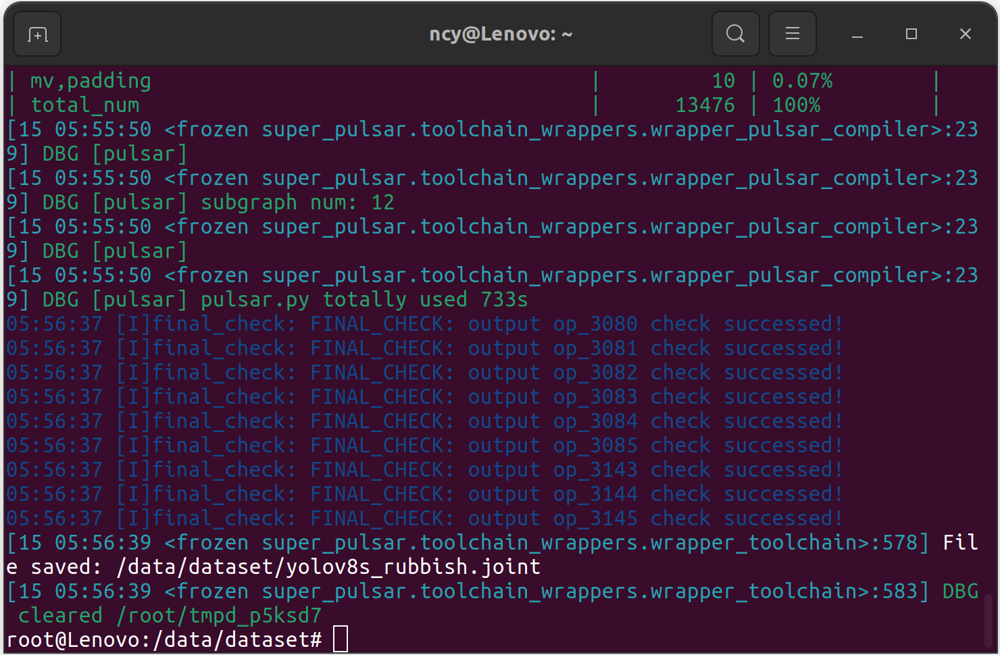

可以在工作目录下找到转换后的模型 yolov8s_rubbish.joint

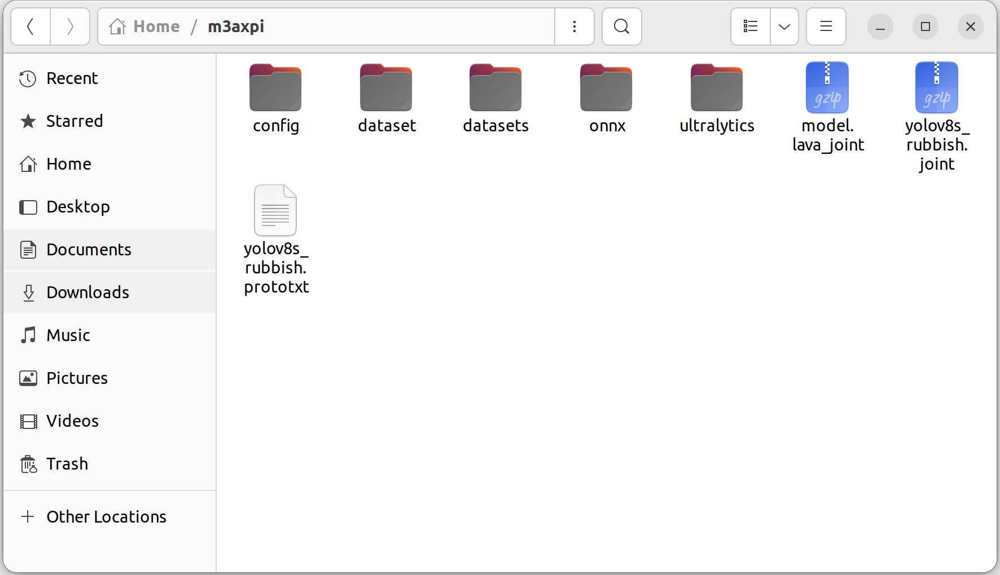

### 八、部署

请参阅 https://github.com/AXERA-TECH/ax-samples

